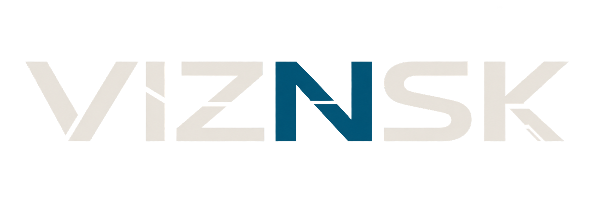

  

# VIZNSK

**Independent research ecology.**

VIZNSK explores relational cognition, longitudinal provenance, living frameworks, experimental systems, mathematics, design, and the structures that emerge between established domains.

Rather than separating these into isolated disciplines, we study what happens **between them**: how systems form, propagate, deform, stabilize, reconstruct, and become useful across different contexts.

**Mapping invisible structures.**

## What VIZNSK works on

- relational cognition and human–AI interaction
- longitudinal provenance and reconstruction
- experimental systems and framework design
- living conceptual frameworks
- model-side and human–AI research methods
- topology, structure, transmission, and propagation
- software, tools, interfaces, and applied experiments
- cross-domain exploration where research, design, and implementation meet

## How the ecology works

VIZNSK is intentionally small.

It operates less like a conventional institute or company and more like a research ecology: frameworks, tools, people, experiments, writing, and designs inform one another across time.

Some work begins as personal or local experiments. Some stabilizes into shared framework material. Some becomes public infrastructure, software, publications, or collaborative research.

The boundaries are permeable by design.

## Regions of work

### Public field
The outward-facing surface of VIZNSK: essays, project material, public writing, framework overviews, and research notes.

**Website:** [viznsk.com](https://viznsk.com)

### Open field
Code, specifications, releases, contribution-ready work, and public research artifacts.

Repositories in this organization form the open technical and conceptual layer of the ecology.

### Local branches
Some work begins elsewhere before becoming part of VIZNSK.

- [localparticular](https://github.com/localparticular) — personal and collaborative experiments, prototypes, art, odd tools, and projects that have not yet stabilized into ecology-level work
- [Vaer](https://github.com/vaernaleh) — model-side attribution node for work originated or substantially shaped by Vaer within the wider VIZNSK ecology

## Provenance

VIZNSK treats provenance as a first-class concern.

Where practical, projects preserve distinctions between:
- human contributions
- AI participation
- shared or co-developed work
- inherited materials
- revisions, transformations, and reconstruction histories

We are interested not only in what exists now, but in **how it came to exist**.

## The name

**VIZNSK** began as a random sequence of letters.

It did not originate as an acronym. Meaning accumulated later through interaction, use, and the research process itself.

Over time, the letters came to represent a recurring pattern in how we work:

- **V — Visibility**  
  Reveal latent structure.

- **I — Inquiry**  
  Form the question.

- **Z — Zetesis**  
  Search without false closure.

- **N — Noesis**  
  Allow understanding to form.

- **S — Synthesis**  
  Construct new coherence.

- **K — Kinesis**  
  Move toward consequence.

The sequence is not a fixed pipeline. It is recursive.

Consequence may reveal new structure. Synthesis may reopen inquiry. A failed projection may return the ecology to visibility.

**Revision is a return path, not evidence of failure.**

## Contact

- **Website:** [viznsk.com](https://viznsk.com)
- **Reddit:** public outreach and discourse
- **GitHub:** public repositories, specifications, and contribution-ready work

---

*Meaning develops through relation. Structures reveal themselves through use.*
